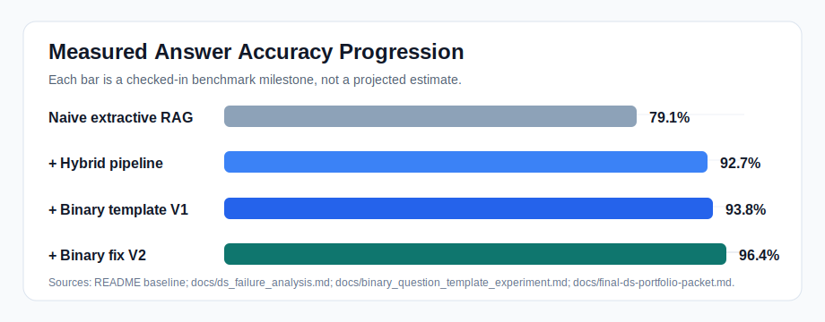

# Warranted


**Warranted is a RAG system that knows when it's wrong.**

It retrieves evidence, synthesizes cited answers, and runs a supervised failure model that flags likely-wrong responses before they reach users, something most RAG systems do not attempt.

Built on 501 telecom regulation documents and 2,839 benchmark cases. Reaches 96.4% answer accuracy, with a supervised failure model at 0.97 ROC-AUC.

[DS Portfolio Report](docs/final-ds-portfolio-packet.md) · [Architecture](docs/architecture.md)

| 99.8% Retrieval Recall | 96.4% Answer Accuracy | 0.97 Failure Model AUC |
|------------------------|----------------------|------------------------|
| across 2,839 cases | after binary fix | XGBoost, 5-fold CV |

## Demo


## The Problem This Solves

Most RAG systems are evaluated at retrieval. They measure whether the right document was fetched, then stop.

That's the wrong place to stop. Fetching the right document doesn't mean producing the right answer. This project measures the full pipeline: retrieval, synthesis, citation. It treats failures as a dataset and trains a model to catch errors the answer layer does not catch itself.

Baseline (naive extractive RAG, no reranking): 79.1% answer accuracy.  
This system: 96.4%.  
The gap is the work.

## Accuracy Progression



## What I Built

- **End-to-end RAG pipeline**: ingestion, normalization, hybrid BM25+vector retrieval, rank fusion, grounded answer synthesis with citations
- **Benchmark evaluation framework**: 2,839 country-level regulation cases, reproducible experiment registry, ablation study tooling
- **Failure analysis**: systematic breakdown of citation anchoring failures, exact-value errors, table extraction gaps, and ISO edge cases
- **Two-phase binary answer workflow**: targeted intervention that raised binary correctness from 82.7% to 99.4%
- **Supervised failure prediction**: XGBoost model trained on pipeline features to flag likely-wrong answers; Brier score 0.045

## Key Results

| Result | Value | What It Means |
| --- | ---: | --- |
| Source corpus | 501 documents / 18,734 blocks | Telecom regulation corpus normalized into searchable evidence units |
| Benchmark | 2,839 cases | Country-level regression set used for pipeline evaluation |
| Naive RAG baseline | 79.1% answer accuracy | Extractive baseline with no reranking and no binary workflow |
| Warranted answer accuracy | 96.4% | Best promoted workflow after targeted binary-answer fix |
| Retrieval recall@k | 99.8% | The right source material is almost always retrieved |
| Evidence hit rate | 99.1% | Retrieved context usually contains the needed supporting evidence |
| Citation accuracy | 90.2% | Cited answer support is strong, but still the main remaining bottleneck |
| Binary correctness | 82.7% -> 99.4% | Two-phase binary workflow fixed the largest answer class |
| Table extraction slice | 86.0% answer correctness | Row-aware retrieval improved structured-value questions |
| Failure model | 0.9702 ROC-AUC / 0.0448 Brier | XGBoost triage model for likely-wrong answers |

## Why Hybrid Retrieval

Pure vector search fails on exact-match queries: regulation IDs, country codes, specific thresholds. Pure BM25 fails on semantic paraphrase. Hybrid rank fusion captures both.

Ablation result: vector-only retrieval reached 94.1% recall@k. Hybrid retrieval reached 99.8%. The difference is about 165 cases where the right document exists, but vector search alone does not find it.

Full study: [docs/retrieval_ablation_study.md](docs/retrieval_ablation_study.md)

## Try It in 3 Minutes

```bash
git clone https://github.com/you/warranted
cd warranted
python -m venv .venv && source .venv/bin/activate
pip install -e .[api]
okr build-index --source-dir data/raw --work-dir data/work
okr ask --work-dir data/work --question "What is the sender availability in Colombia?"
```

Expected output:

```text
For colombia, the Sender availability is: Short Code (shared or dedicated).
```

Launch the local UI:

```bash
okr serve-api --host 127.0.0.1 --port 8000
```

Open `http://127.0.0.1:8000/`.

## What I'd Do With More Time

- **Scale test**: current corpus is 501 documents. The architecture is designed to generalize, but I haven't stress-tested retrieval latency above ~50k chunks. Next step is a Qdrant backend benchmark at 500k+ chunks.
- **Online failure detection**: the current failure model runs post-hoc. A real deployment would score answers in the API response and surface low-confidence flags in the UI.
- **Feedback loop**: the benchmark is static. A production system needs user corrections fed back into evaluation. I'd design a thumbs-down -> re-evaluation pipeline.
- **Multilingual**: telecom regulation exists in dozens of languages. The normalization pipeline is language-agnostic but the embedding model is English-only. Swapping to multilingual-e5 is one config change; I just haven't benchmarked it yet.

## Portfolio Artifacts

- [Final DS Portfolio Packet](docs/final-ds-portfolio-packet.md): the best single read; summarizes the product, experiments, failure analysis, and model results.
- [Answer Failure Model](docs/answer_failure_model.md): explains the XGBoost triage model, calibration, false-negative audit, and why the model is framed as post-answer review.
- [Retrieval Ablation Study](docs/retrieval_ablation_study.md): compares retrieval strategies and motivates the hybrid BM25+vector design.

Full documentation lives in [docs/](docs/), including CLI usage, configuration, corpus analysis, binary-answer experiments, and table extraction hardening.
